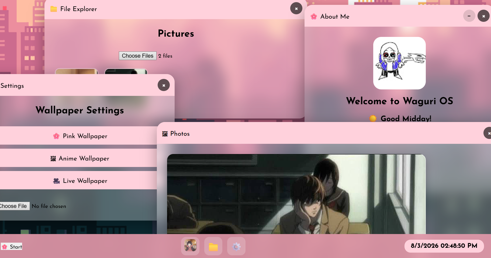
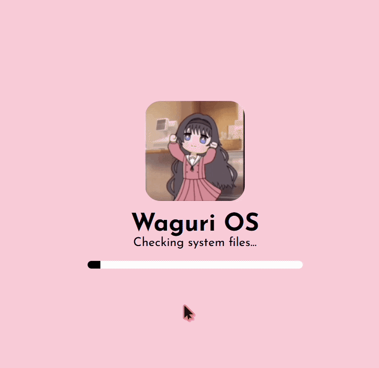

# 🌸 Waguri OS

An anime-inspired desktop operating system built entirely with **HTML, CSS, and JavaScript**.

Waguri OS recreates the experience of a real desktop operating system inside a web browser. It features a boot sequence, user login, draggable windows, a taskbar, desktop icons, wallpaper customization, a file explorer, a photo viewer, notifications, and much more.

---

# 📸 Preview



> *The current Waguri OS desktop featuring the About Me app, File Explorer, Settings, Photo Viewer, live wallpaper support, and a Windows-inspired taskbar.*

---

## ✨ Features

- 🌸 Animated boot screen
- 👤 Username setup with saved profile
- 🖥️ Desktop environment
- 📌 Windows-style taskbar
- 🌸 Start Menu
- 🪟 Draggable application windows
- ⚙️ Settings application
- 🎨 Wallpaper changer
- 🖼️ Custom wallpaper upload
- 📁 File Explorer
- 🖼️ Photo Viewer
- 🔔 Notification system
- 🕒 Live clock
- 👋 Dynamic greeting
- 🗑️ Recycle Bin
- ⌨️ Keyboard shortcuts
- 🔊 Boot and shutdown sound support

---

## 📸 Screenshots


### 🖥️ Desktop


## 🚀 Getting Started

### Requirements

- Node.js 20+ *(optional, only if using a development server)*
- Visual Studio Code *(recommended)*
- Live Server Extension *(recommended)*

---

## 📁 Project Structure

```text
Waguri-OS/

├── index.html
├── style.css
├── script.js
├── Waguri.gif
├── boot.mp3
├── shutdown.mp3
├── pink.jpg
├── anime.jpg
├── images/
│   └── desktop.png
└── README.md
```

---

## ⚙️ Environment

No environment variables are required.

No database is required.

No backend server is required.

---

## ▶️ Run

If using Live Server:

```text
Right-click index.html

↓

Open with Live Server
```

Or simply open **index.html** in your browser.

---

## 🛠️ How It Works

Waguri OS is built entirely with vanilla HTML, CSS, and JavaScript without external frameworks.

Every desktop component, including the boot screen, taskbar, desktop, wallpaper manager, notifications, and application windows, is built from scratch.

Windows are managed using reusable JavaScript functions that support opening, closing, minimizing, dragging, and z-index stacking. User preferences such as usernames and wallpapers are saved locally using the browser's Local Storage API, allowing the desktop to remember settings between sessions without requiring a backend server.

This approach demonstrates how a desktop-style operating system can be recreated using standard web technologies while remaining lightweight and easy to extend.

---

## 🔮 Future Plans

- 🌐 Web Browser
- 📝 Notepad
- 🎵 Music Player
- 🎥 Video Player
- 🧮 Calculator
- 📅 Calendar
- 🔍 Search
- 🌙 Dark Mode
- 📂 Folder System
- 🎨 Themes
- 💻 Terminal
- 📦 App Store

---

## 🙏 Credits

Created by **Umi**

Special thanks to:

- Hack Club
- Stardance
- Google Fonts (Josefin Sans)
- The open-source web development community

---

## 📄 License

This project is licensed under the **MIT License**.